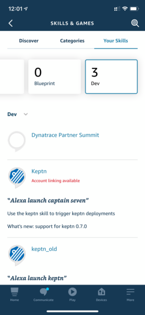
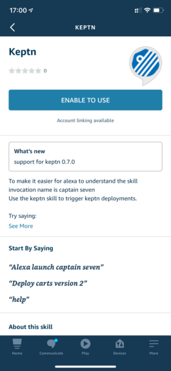
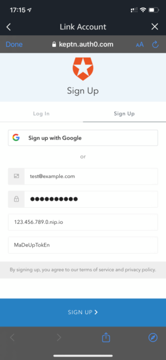

# alexa-skill

| Authors | Keptn Version | Comment |
| ------ | --------------| -------- |
| [@alipatton10](https://github.com/alipatton10) | 0.7.0 | Initial Release |

This Alexa skill is can be used to demo keptn.

## Skill Overview
This skill is designed to demo the keptn. I designed this as a fun way to demo keptn and to show that keptn is API controllable. If you can trigger it with a voice command then you can integrate it with any piece of software that supports API calls. This is really only designed for demos and not prouction usecases. The skill invocation name is captain seven. This is beacuse it is required to have 2 or more words and it sometimes struggled with keptn.

Check out this example of the skill in action

## Skill Setup
I am currently running a beta test for the skill so it is not pubilcally available. If you would join the beta test please reach out to me on the keptn slack workspace.

Once you are invited to the beta you will recieve an email form Amazon with a link to the beta. Click on the link, log into your alexa account and agree to the beta.
Once you have done this you need to enable the skill and configure accoutn linking.
1. Open the alexa app and navigate to More > Skills & Games > Your Skills > Dev

2. Select the Keptn skill and click `ENABLE TO USE`

3. To access your keptn credentials the skill requires account linking to Auth0, during the account linking you will provide your keptn endpoint and token. Click on `SETTINGS`

4. Click on `Link Account`

5. This will launch the connection to the keptn auth0 account which is where your keptn details will be stored. You need to sign up for this so click on `Sign Up`

6. Input your email address \(this can be any address and doesn't have to be the same one as you alexa account\), a password, your keptn endpoint \(without http\(s\):\/\/ and training \/\) and your decoded keptn API token.

Authorize the App by clicking on `Accept`

7. Your skill should now be successfully setup and you can use it. Launch the skill by saying `\"Alexa launch captain seven\"`. The first time you launch it the skill needs to reach out to auth0 to get your keptn details, this is done automatically by saying `configure` but don't worry the skill will talk you through that.

## Supported Commands

The skill currently supports the following commands. Once you have the skill enabled and configured you can trigger these by saying `Alexa, ask captain seven \<command\>` so for example to learn about keptn you could say `\"Alexa ask captain seven describe\"`

| Command | Supported variations | Purpose | Notes |
| ------- | -------------------- | ------- | ----- |
| Describe | Describe, Describe keptn, Describe captain, What is captain & What is keptn | Give an overview of what keptn is | The describe command can be run without account linking. It is non interactive and no additional information needs to be supplied |
| Projects | Project, Projects, Project details, List my projects & What are my projects | List the number of projects and their names | The projects command requires account linking. If you have not enabled account linking it will inform you of this. It is non interactive and no additional information needs to be supplied |
| Launch | Launch captain seven or captain seven | This is a default command which is triggered when you launch the skill. | The launch command doesn't require account linking but it will give different output depending on if it is enabled or not and if you have already called configure or not. This is an interactive command and at the end will reprompt the user for a further command. As the skil is already active you do not need the skill invocation name for the follow up, you can simly say any command such as `\"Describe\"` |
| Deploy | Deploy, Deploy version \{version\} to \{service\} or Deploy \{service\} version \{version\} | Deploy a new version | The Deploy command requires account linking. If you have not enabled account linking it will inform you of this. This is an interactive command as you need to specify the service name and version you want to deploy. For example `\"Deploy carts version 2\"`. Please note this command only supports carts and simplenode. The project and service names are also hard coded so for carts it must be sockshop, carts and for Andi's simple node it must be keptnsample and simplenode. |

## Known Limitations
1. No connection to the keptn alexa notification service
2. Project and service names are hard coded so only supports carts and simple node provided the project names are sockshop and keptnsample respectively.
