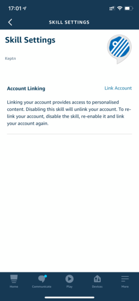

# Overview

The Keptn Alexa skill is designed to demonstrate in a fun way the integration to the [Keptn API](https://keptn.sh/docs/0.7.x/reference/api/).

Using an Alexa device or Alexa app on your phone, you can invoke Keptn with a voice command as shown in the diagram below.

Check out this [MP4 video found in this repo](./videos/keptn070.mp4) to watch the skill in action.

# Known Limitations
1. Project and service names are hard coded so only supports carts and simple node provided the project names are sockshop and keptnsample respectively.
1. [Auth0](https://auth0.com) is used to store your Keptn credentials. You will be prompted to register your email with Auth0 as part of the installation. The Auth0 account is also managed by the [skill maintainer](#Maintainer) so you will need to contact him to adjust your Keptn settings if there is problems.
1. No connection to the [Keptn Alexa notification service](https://github.com/keptn-sandbox/alexa-notification-service)

# Access to the skill

This repo does not contain the code for the skill.  The skill is published within Amazon Alexa.

The Alexa skill is currently private so you will need to contact the [skill maintainer](#Maintainer) for an invitation to the skill.

# Keptn compatibility matrix

The Alexa skillis compatable with these versions of Keptn.

| Keptn Version |
| ------ | 
| 0.7.0 | 
| 0.7.1 |

# Maintainer

[Alasdair Patton](https://github.com/alipatton10) - contact Keptn Slack Channel or @ Alasdair.Patton@dynatrace

# Supported Commands

The skill currently supports the following commands. Once you have the skill enabled and configured you can trigger these by saying `Alexa, ask captain seven <command>` so for example to learn about keptn you could say `"Alexa ask captain seven describe"`

| Command | Command_Purpose | Command_Variations | Notes |
| ------- | ---------------------------- | --------------- | ----- |
| Launch | This is a default command which is triggered when you launch the skill. | >`Launch captain seven` >`captain seven` |  The launch command doesn't require account linking but it will give different output depending on if it is enabled or not and if you have already called configure or not. This is an interactive command and at the end will reprompt the user for a further command. As the skill is already active you do not need the skill invocation name for the follow up, you can simply say any command such as `Describe` |
| Describe | Give an overview of what keptn is | >`Describe` >`Describe captain` >`What is captain` | The describe command can be run without account linking. It is non interactive and no additional information needs to be supplied |
| Projects | List the number of projects and their names | >`Project` >`Projects` >`Project details` >`List my projects` >`What are my projects` | The projects command requires account linking. If you have not enabled account linking it will inform you of this. It is non interactive and no additional information needs to be supplied |
| Deploy | Deploy a new version | >`Deploy` >`Deploy version {version} to {service}` or >`Deploy {service} version \{version\}` | The Deploy command requires account linking. If you have not enabled account linking it will inform you of this. This is an interactive command as you need to specify the service name and version you want to deploy. For example `Deploy carts version 2`. Please note this command only supports carts and simplenode. The project and service names are also hard coded so for carts it must be sockshop, carts and for simple node it must be keptnsample and simplenode. |

# Skill setup

Refer to the diagram below of the setup process.

1. [Keptn Setup and onboard a project and service](https://keptn.sh/docs/quickstart/)

2. Request Access to the skill

    This skill is still beta, so contact the [skill maintainer](#Maintainer) for an invitation. Once you are invited to the beta you will receive an email form Amazon with a link to the beta. Click on the link, log into your Alexa account and agree to the beta.

3. Open the Alexa app and navigate to More > Skills & Games > Your Skills > Dev

    

4. Select the Keptn skill and click `ENABLE TO USE`

    

5. To access your keptn credentials the skill requires account linking to Auth0, during the account linking you will provide your keptn endpoint and token. Click on `SETTINGS`

    

6. Click on `Link Account`

    

7. This will launch the connection to the keptn auth0 account which is where your keptn details will be stored. You need to sign up for this so click on `Sign Up` or enter an email and password to use.

    

8. Input your email address \(this can be any address and doesn't have to be the same one as you Alexa account\), a password, your keptn endpoint \(without http\(s\):\/\/ and training \/\) and your decoded keptn API token. Do not use the sign up with google option.

    

    Authorize the App by clicking on `Accept`

8. Your skill should now be successfully setup and you can use it. Launch the skill by saying `"Alexa launch captain seven"`. The first time you launch it the skill needs to reach out to auth0 to get your keptn details, this is done automatically by saying `configure` but don't worry the skill will talk you through that.

    
